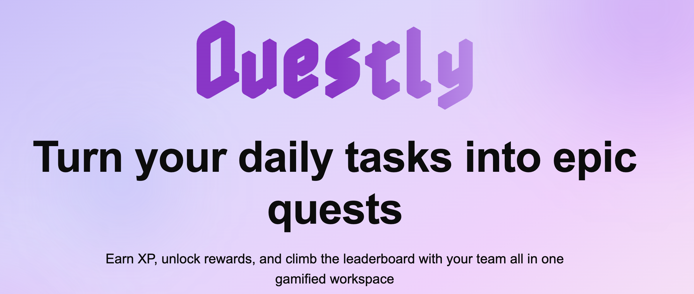
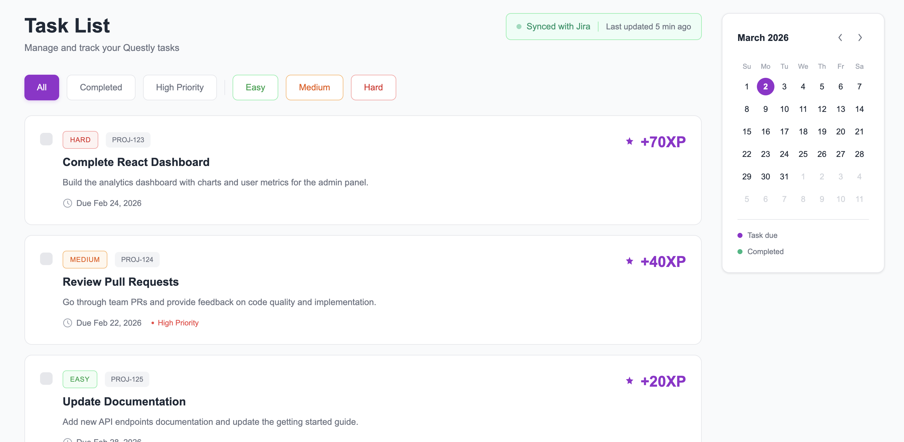
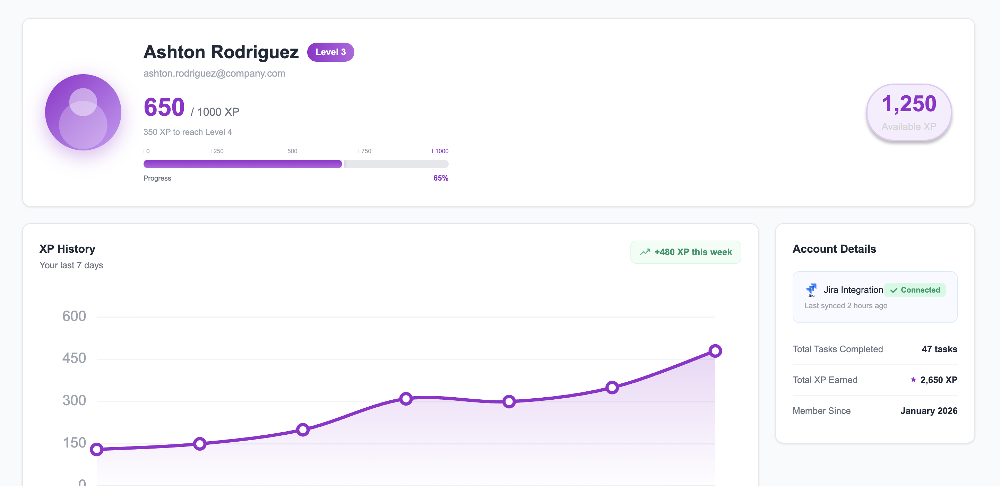
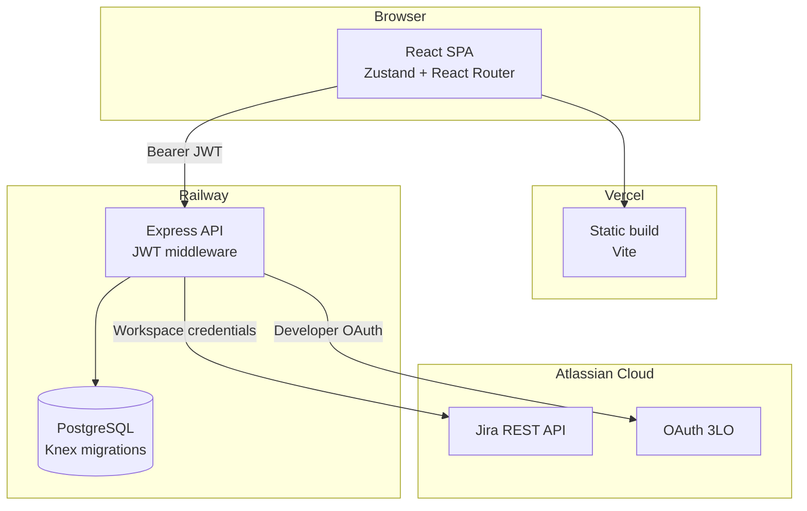

<p align="center">
  
</p>

<h1 align="center">Questly</h1>

<p align="center">
  <strong>Gamified task management powered by Jira.</strong><br/>
  Complete real tickets, earn XP, level up, and redeem rewards — as a team.
</p>

<p align="center">
  <a href="https://questly-gilt.vercel.app">Live App</a> ·
  <a href="https://questly-production-f5ba.up.railway.app/api/health">API</a> ·
  <a href="docs/SUBMISSION.md">Submission Package</a> ·
  <a href="docs/README.md">Documentation</a>
</p>

<p align="center">
  
  
  
  
  
</p>

---

## Table of contents

- [Overview](#overview)
- [Screenshots](#screenshots)
- [Features](#features)
- [Architecture](#architecture)
- [Architectural decisions](#architectural-decisions)
- [Tech stack](#tech-stack)
- [Repository layout](#repository-layout)
- [Getting started](#getting-started)
- [Testing](#testing)
- [Deployment](#deployment)
- [Documentation](#documentation)
- [Team](#team)

---

## Overview

Questly bridges productivity tools and team motivation. Admins connect a **workspace** to Jira Cloud; assigned issues sync as **quests** with XP derived from story points. Developers complete work inside Questly, climb levels, earn Coins, and spend them in the Reward Shop — while admins manage sprints, approvals, and team performance.

Built as a final-year Information Systems capstone, Questly runs in production on **Vercel** (frontend) and **Railway** (API + PostgreSQL).

| Role | Experience |
|------|------------|
| **Developer** | Dashboard, task list, reward shop, profile, personal Jira connect |
| **Admin** | Workspace setup, Jira sync, join requests, sprint management, reward approvals |

---

## Screenshots

<table>
  <tr>
    <td width="50%">
      
      <br/><sub><b>Task List</b> — Jira-synced quests with difficulty badges, XP rewards, filters, and due-date calendar</sub>
    </td>
    <td width="50%">
      
      <br/><sub><b>Profile</b> — level progress, XP history chart, Jira connection status, and lifetime stats</sub>
    </td>
  </tr>
</table>

---

## Features

### Developer
- **Jira-backed quests** — assigned issues sync with difficulty, XP, due dates, and priority badges
- **XP & leveling** — lifetime XP drives levels; sprint XP resets each sprint for fair reward-shop spending
- **Dual economy** — XP for progression, Coins for purchases (default: 100 XP → 10 Coins)
- **Reward Shop** — spend sprint XP on real-world coupon rewards (admin approval flow)
- **Task completion** — mark quests done in Questly to earn XP; Jira status is display-only until sync
- **Team Jira banner** — after join approval, UI shows the admin's Jira site hostname for guided connect
- **OAuth or API token** — personal Jira connect via Atlassian 3LO or classic API token

### Admin
- **Workspace & Jira** — connect workspace Jira (API token or OAuth), sync issues, prune stale tasks
- **Join requests** — approve developers; team `jira_site_url` travels with approval
- **Sprint management** — open/close sprints; sprint XP resets on close with audit trail
- **Reward catalog** — upload coupon codes, approve/deny purchase requests
- **Team dashboard** — leaderboard, member XP, pending approvals

### Platform
- **Multi-tenant isolation** — every task, reward, and assignment is workspace-scoped
- **Encrypted tokens** — Jira credentials encrypted at rest (AES-256-GCM) when `JIRA_TOKEN_ENCRYPTION_KEY` is set
- **Legal & compliance** — `/privacy` and `/terms` pages; Atlassian personal-data reporting API
- **CI/CD** — GitHub Actions: backend tests, frontend coverage, Playwright E2E, deploy to Railway + Vercel

---

## Architecture

Questly is a **two-app monorepo**. The browser loads static assets from Vercel; authenticated API calls go to Railway via `VITE_API_URL`.



### Core domains

| Domain | Responsibility |
|--------|----------------|
| **Workspaces** | Tenant boundary — admin owns workspace, developers join via invite code |
| **Jira sync** | Admin pulls project issues → quests; story points map to difficulty and XP |
| **Task assignments** | Per-user completion state; shared tasks supported |
| **XP economy** | Sprint XP (resets), lifetime XP (levels), Coins (reward shop) |
| **Rewards** | Admin-managed catalog; developer purchases require approval |

### Jira integration model

Two layers keep admin sync and developer identity separate:

| Layer | Actor | Storage | Purpose |
|-------|-------|---------|---------|
| **Workspace** | Admin | `workspaces.jira_*` | Sync issues, assignee lookup, project scope |
| **Developer** | Developer | `users.jira_account_id` + tokens | Map Jira assignee → Questly user |

Platform env (`ATLASSIAN_CLIENT_ID`, `ATLASSIAN_CLIENT_SECRET`) is used **only** for OAuth — not for per-tenant API calls. Production credentials live in Postgres per workspace.

**Story points → XP:**

| Story points | Difficulty | XP reward |
|-------------|------------|-----------|
| 1–2 | Easy | 20 |
| 3–5 | Medium | 40 |
| 8+ | Hard | 70 |
| unset | Medium | 40 |

---

## Architectural decisions

Decisions made during development, with rationale:

### Multi-tenancy & data isolation
- **Workspace-scoped everything** — tasks upsert on `(workspace_id, jira_issue_id)` so tenants never collide, even when Jira issue IDs overlap across sites.
- **JWT role checks** — `admin` and `developer` roles enforced in middleware and route guards; cross-workspace access returns 403.
- **No platform Jira fallback in production** — global `JIRA_*` env vars work for local dev/CI only; Railway uses per-workspace DB credentials.

### Jira onboarding (S15/S16)
- **One mental model for developers** — "connect *my* Jira → join a team → get work." Workspace sync stays admin-only and hidden from developer UI.
- **Team site travels with join** — on approval, `expected_jira_site_url` is returned so developers see the correct Atlassian hostname before connecting.
- **Friendly gating** — pre-workspace users get empty states and clear copy, not raw 401/503 errors from missing Jira config.
- **Dual connect paths** — developers use OAuth 3LO or API token; admins use workspace OAuth or API token for sync.

### Task lifecycle
- **Complete in Questly, not Jira** — XP is awarded on `PATCH /api/tasks/:id/completion` in Questly. Jira Done status is informational until the next sync.
- **Per-assignment completion** — multiple developers can share a quest; each has their own `completed_at` on `task_assignments`.
- **Sync prune** — after each Jira sync, tasks whose `jira_issue_id` no longer exists in Jira are removed automatically.
- **Reconcile assignments** — sync adds/removes assignees based on Jira assignee changes; completed assignments are preserved.

### XP & rewards economy
- **Sprint XP vs lifetime XP** — sprint XP resets when admin closes a sprint (fair reward-shop seasons); lifetime XP drives levels and profile stats.
- **`xp_transactions` audit trail** — every award and revocation is logged for debugging and integrity.
- **Soft-delete purchases** — coupons can be removed from My Rewards UI while purchase records remain for audit.

### Security & compliance
- **AES-256-GCM token encryption** — Jira refresh/access tokens stored with `enc:v1:` prefix when `JIRA_TOKEN_ENCRYPTION_KEY` is set; plaintext read-through when unset (dev).
- **No `password_hash` in API responses** — `UserModel.strip()` on all outward-facing user objects.
- **Atlassian distribution** — privacy/terms pages and personal-data reporting API for OAuth app compliance.

### Frontend architecture
- **React Router 7** — file-based routes with `ProtectedRoute` role guards; replaced early custom state routing.
- **Zustand stores** — domain stores (`authStore`, `taskStore`, `rewardStore`, etc.) instead of prop drilling.
- **Vite dev proxy** — `/api` → `localhost:3001` in development; `VITE_API_URL` baked at build for production.

### Testing & CI
- **Jest + nock for Jira** — backend sync tests intercept real HTTP shapes without mocking the sync service.
- **E2E seed API** — test-only endpoints seed workspaces/tasks without live Jira in Playwright CI.
- **Playwright `workers: 1`** — serial E2E avoids race conditions on shared test DB.
- **Coverage thresholds** — Vitest (frontend) and Jest (backend) enforce minimum coverage in CI.

### Operations
- **Knex migrations** — schema changes are versioned; `npm run migrate` on Railway after deploy.
- **Duplicate task cleanup script** — one-time `server/scripts/cleanup-duplicate-jira-tasks.cjs` for orphan rows from pre-S14 workspaces.
- **Monorepo deploy split** — Vercel builds repo root (frontend); Railway builds `server/` as `/app`.

---

## Tech stack

| Layer | Technology |
|-------|------------|
| Frontend | React 19, Vite 7, Tailwind CSS v4, React Router 7, Zustand, Motion |
| Backend | Node.js, Express 4, Knex, PostgreSQL 15 |
| Auth | JWT (`jsonwebtoken`), bcrypt |
| Integrations | Jira Cloud REST API, Atlassian OAuth 3LO |
| Testing | Vitest, Testing Library, Jest, Supertest, Playwright, nock |
| Infrastructure | Vercel, Railway, Docker Compose (local Postgres) |
| CI | GitHub Actions |

---

## Repository layout

```
Questly/
├── src/                    # React frontend
│   ├── pages/              # Route-level views
│   ├── components/         # Shared UI (TaskCard, JiraIntegrationCard, …)
│   ├── stores/             # Zustand state (auth, tasks, rewards, …)
│   ├── router/             # React Router config + ProtectedRoute
│   └── lib/                # API client, XP helpers
├── server/                 # Express API
│   ├── controllers/        # Route handlers
│   ├── models/             # Knex data access
│   ├── services/           # Jira sync, XP, rewards, OAuth
│   ├── migrations/         # PostgreSQL schema (16 migrations)
│   └── scripts/            # Prod ops (duplicate task cleanup)
├── e2e/                    # Playwright journeys
├── docs/                   # API, write-up, demo, screenshots, archive
├── scripts/                # Jira smoke test + dev GitHub tooling
├── .env.example            # Env template → copy to server/.env
├── AGENTS.md               # Cursor Cloud dev guide
└── DEPLOY.md               # Production deployment runbook
```

---

## Getting started

### Prerequisites

- Node.js 18+
- PostgreSQL 15 ([Docker Compose](docker-compose.yml) or local install)

### Quick start

```bash
git clone https://github.com/Jordan1881/Questly.git
cd Questly
npm install && cd server && npm install && cd ..

docker compose up -d                              # Postgres
cp .env.example server/.env                     # set JWT_SECRET
cd server && npm run migrate && cd ..

# Terminal 1 — API (:3001)
cd server && npm run dev

# Terminal 2 — Frontend (:5173, proxies /api → :3001)
npm run dev
```

Open **http://localhost:5173**. Sign-in uses **email** (not the username label). Dismiss or skip the Jira connect modal to reach `/dashboard`.

For Jira integration locally, copy secrets from `.env.example` into `server/.env` — see [AGENTS.md](AGENTS.md).

---

## Testing

```bash
# Frontend unit tests + coverage
npm run test:coverage

# Backend integration tests
cd server && npm run migrate:test && npm test

# E2E (Postgres + migrated DB + both servers running)
npx playwright test
```

| Layer | Tool | What it covers |
|-------|------|----------------|
| Frontend units | Vitest + Testing Library | Stores, components, hooks |
| Backend integration | Jest + Supertest + nock | Routes, models, Jira sync |
| E2E | Playwright | Auth, onboarding, 5 user journeys |
| Security / edge | Jest | Cross-workspace 403, concurrency, edge cases |

---

## Deployment

| Service | Platform | URL |
|---------|----------|-----|
| Frontend | Vercel | https://questly-gilt.vercel.app |
| API + DB | Railway | https://questly-production-f5ba.up.railway.app |

Full runbook: **[DEPLOY.md](DEPLOY.md)** — env vars, OAuth callbacks, migrations, Atlassian distribution, ops scripts.

---

## Documentation

| Document | Description |
|----------|-------------|
| [docs/README.md](docs/README.md) | Documentation index |
| [docs/API.md](docs/API.md) | REST API reference |
| [docs/WRITEUP.md](docs/WRITEUP.md) | Architecture deep-dive |
| [docs/DEMO.md](docs/DEMO.md) | Demo script & talking points |
| [docs/SUBMISSION.md](docs/SUBMISSION.md) | Capstone deliverables (M8) |
| [docs/questly-schema.mermaid](docs/questly-schema.mermaid) | ER diagram |
| [AGENTS.md](AGENTS.md) | Cloud agent / local dev guide |
| [DEPLOY.md](DEPLOY.md) | Production deployment |

---

## Team

| Name | Role |
|------|------|
| Yarden Biton | Lead Developer |
| Or Moskowitz | Developer |

---

<p align="center">
  <sub>Built with ☕ and a lot of XP — Questly © 2026</sub>
</p>
