# Questly — Presentation Overview

## Project in one sentence

Questly adds a secure, multi-tenant motivation layer to Jira Cloud: real issues become quests, completed work earns XP and Coins, and Coins unlock team-managed rewards.

## End-to-end architecture

```mermaid
flowchart LR
    A[Jira Cloud<br/>Issues, assignees, story points]
    B[Admin Jira connection<br/>OAuth or API token]
    C[Workspace sync<br/>Upsert and prune]
    D[Questly quests<br/>Difficulty, XP, due date]
    E[Developer completion<br/>Per assignment]
    F[Progress economy<br/>Lifetime XP, sprint XP, Coins]
    G[Reward Shop<br/>Purchase request]
    H[Admin approval<br/>Coupon fulfilment]

    A --> B --> C --> D --> E --> F --> G --> H
    C -. workspace isolation .-> D
    E -. audit transaction .-> F
```

**System ownership:** Jira is the source of truth for issues, assignees, story points, and displayed status. Questly is the source of truth for quest completion, XP, levels, Coins, purchases, and rewards.

## Role-based user stories

| Role | User story | Jira interaction | Questly outcome |
|------|------------|------------------|-----------------|
| Admin | As an admin, I connect a workspace to the correct Jira site and project. | OAuth auto-discovers accessible sites and projects; API-token connection is also supported. | The workspace receives its own encrypted Jira configuration. |
| Admin | As an admin, I synchronize project work for my team. | Questly reads issues, story points, assignees, priority, status, and dates. | Issues are upserted as workspace-scoped quests and stale Jira quests are pruned. |
| Developer | As a developer, I connect my Jira identity. | Personal OAuth or API-token connection resolves the developer's Jira account ID. | Jira assignees map to the correct Questly member. |
| Developer | As a developer, I complete assigned work and see progress. | Jira supplies the issue context; completion remains in Questly. | The developer earns lifetime XP, sprint XP, and Coins. |
| Developer | As a developer, I spend earned Coins on rewards. | No Jira write is required. | A purchase enters the reward approval and coupon fulfilment flow. |
| Admin | As an admin, I manage motivation and team progress. | Synced Jira work remains the evidence behind quests. | The admin manages sprints, approvals, rewards, and team standings. |

## Evidence and engineering metrics

| Area | Repository evidence | Why it matters |
|------|---------------------|----------------|
| Backend verification | 41 Jest/Supertest test files | Covers routes, models, Jira sync, OAuth, rewards, security, races, and performance. |
| Frontend verification | 41 Vitest/Testing Library test files | Covers stores, hooks, pages, overlays, and reusable UI behavior. |
| End-to-end verification | 8 Playwright specification files, including 5 named user journeys | Demonstrates complete role-based flows rather than isolated screens. |
| Multi-tenancy | Workspace-scoped tasks, assignments, rewards, memberships, and Jira credentials | Prevents cross-team data collisions and unauthorized access. |
| Credential security | Jira tokens support AES-256-GCM encryption at rest | Reduces the impact of database disclosure. |
| Integration performance | A 110-issue Jira sync has a less-than-3-second regression test | Makes synchronization behavior measurable. |
| Delivery | CI runs backend tests, frontend coverage, and E2E checks | Provides repeatable evidence that the integrated system works. |

Counts reflect test files present in the repository on 17 July 2026; they are file counts, not individual assertion counts.

## Scope and limitations

- Questly deliberately does not clone Jira boards, workflows, comments, or issue editing.
- Quest completion does not currently transition Jira issues; Jira status is refreshed on synchronization.
- Synchronization is initiated by an admin rather than by Jira webhooks or a scheduler.
- Gamification focuses on a coherent work-to-reward loop rather than a broad catalogue of badges.

These limits keep the graduation-project scope focused on the Jira-to-gamification integration, multi-tenant correctness, and a demonstrable reward economy.
