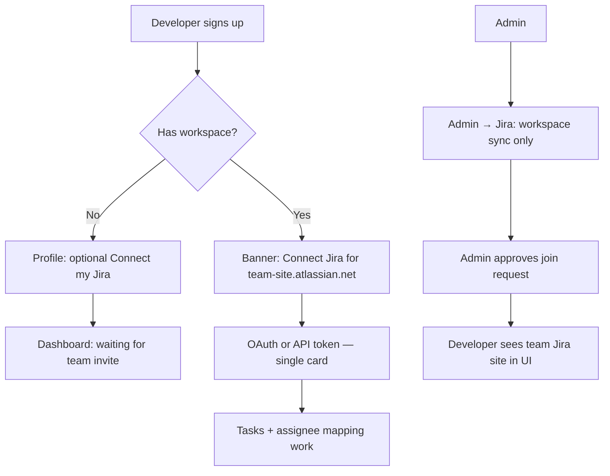

# S15 / S16 — Simplify Developer Jira Onboarding

**Epic parent:** Multi-tenant Jira (#179)  
**Problem:** Developers see two Jira concepts (workspace vs personal), get 401/503 before joining a team, and must discover the admin’s Jira site themselves.  
**Goal:** One mental model — *connect my Jira, join a team, get work* — while admin workspace sync stays admin-only.

---

## Target experience

| Actor | Sees | Hidden |
|-------|------|--------|
| Developer | “Connect **my** Jira” + team site hint after approval | Workspace API token, project key, sync |
| Admin | Workspace Jira + sync + join requests | Developer token details |

---

## Sprint S15 — Short term (no big rewrite)

**Theme:** Friendly gating + site URL travels with the invite.  
**Estimate:** 5 tickets, ~1 PR each.  
**Ship when:** E2E journey-1 updated + manual prod smoke (Yarden flow).

### T151 — Pre-workspace Jira connect without errors

**Layer:** Backend + Frontend  
**Blocked by:** None

**What to build**

- Allow `POST /api/auth/me/jira/connect` when `workspace_id` is null **if** developer supplies optional `jira_site_url` in body (self-declared) **or** defer connect until post-join (preferred: connect allowed but validation uses optional site).
- **Preferred minimal approach:** keep connect requiring a site, but when no workspace return **400 with actionable copy**, not 503; Profile shows **empty state** instead of connect form errors:
  - *“Join a team first, or connect Jira after your admin approves you.”*
- Dashboard / Task List for `!workspace_id`: empty state card → link to `/workspace/join`, not broken task fetch.
- Profile `JiraIntegrationCard`: three states — no workspace (info), workspace + not connected (connect), connected.

**Acceptance criteria**

- [ ] Developer with no workspace never sees raw `Jira request failed with HTTP 401` from missing site config
- [ ] Profile explains: workspace invite required before Jira link is required for tasks
- [ ] Developer **may** open Profile and read Jira section before join (no crash / no misleading “Connected”)
- [ ] Unit tests: `JiraIntegrationCard` states; API test for connect without workspace returns clear 400 message
- [ ] Existing workspace member connect flow unchanged

**Files (likely)**

- `server/controllers/auth.js` — `connectJira` error messages
- `src/components/JiraIntegrationCard.jsx`
- `src/pages/Dashboard.jsx`, `src/pages/TaskList.jsx` — no-workspace empty states

---

### T152 — Expose team Jira site on join approval

**Layer:** Backend + Frontend  
**Blocked by:** T151 (copy depends on site being available)

**What to build**

- On join approval response, include `workspace.jira_site_url` (sanitized, no token) in `PATCH .../join-requests/:id` body.
- Extend `GET /api/auth/me` (or `GET /api/join-requests/mine`) to return `expected_jira_site_url` when user has `workspace_id` and workspace has `jira_site_url`.
- After approval (poll `fetchMe` or websocket-less refresh): show banner on Dashboard + Profile:
  - *“Your team uses **yourteam.atlassian.net** — connect your Jira account to receive assigned tasks.”*
- `WorkspaceJoin` pending state: optional hint *“After approval, connect Jira on Profile.”*

**Acceptance criteria**

- [ ] Approved developer sees `jira_site_url` hostname in UI within one page load (no admin copy-paste)
- [ ] `GET /api/auth/me` includes `expected_jira_site_url` (or nested `workspace.jira_site_url`) for members
- [ ] Join approval API response includes sanitized workspace with `jira_site_url`
- [ ] If workspace Jira not connected by admin, developer sees: *“Admin hasn’t connected team Jira yet”* (not 401)

**Files (likely)**

- `server/controllers/joinRequest.js`, `server/controllers/auth.js`
- `src/stores/authStore.js`, `src/pages/Dashboard.jsx`, `src/components/JiraIntegrationCard.jsx`

---

### T153 — Developer copy: hide workspace Jira concept

**Layer:** Frontend  
**Blocked by:** T152

**What to build**

- Replace developer-facing strings:
  - ❌ “workspace Jira”, “ask admin to connect workspace”
  - ✅ “team Jira site”, “connect **your** Jira account”
- `JiraIntegrationCard` helper text: *“Use the same email as your Questly account. Your admin’s team site: `{host}`.”*
- Sign-up `JiraAuth` overlay: skip or soften for developers without workspace (link to Profile later); keep skip.
- Remove `JiraIntegrationCard` line *“Manage workspace Jira connection in the Admin panel”* from developer Profile (admin-only context).

**Acceptance criteria**

- [ ] Grep `src/` — no developer UI string says “workspace Jira”
- [ ] Admin `JiraSyncTab` still says “workspace” / “Connect Jira” for sync (unchanged)
- [ ] Token connect placeholder references team site host when known

---

### T154 — Connect validates against team site

**Layer:** Backend  
**Blocked by:** T152

**What to build**

- When developer has `workspace_id`, `connectJira` **must** use workspace `jira_site_url` (already partial); reject with 400 if token valid on wrong site:
  - *“This token doesn’t have access to {host}. Ask your Jira admin to invite you.”*
- Map Jira 401 to user-friendly messages (email/token mismatch vs not on site).
- On join approval, `ensureDeveloperJiraAccountId` already runs — log/return soft warning if lookup fails (no throw).

**Acceptance criteria**

- [ ] Connect with valid token on wrong Atlassian site → 400 with `site_not_accessible` style message
- [ ] Connect with 401 → message mentions email match + Jira invite (not generic HTTP 401)
- [ ] Integration test: developer in workspace, nock `/myself` 401 → readable error body
- [ ] Join approval still succeeds when Jira lookup fails

**Files (likely)**

- `server/controllers/auth.js`, `server/services/jiraClient.js`

---

### T155 — E2E: developer onboarding without confusion

**Layer:** E2E  
**Blocked by:** T151–T154

**What to build**

- Update `e2e/journey-1.spec.js` (or add `journey-1b`):
  1. Developer signup → no workspace → sees join empty state
  2. Submit join code → pending
  3. Admin approves (seed/API)
  4. Developer refresh → sees team site banner
  5. Connect Jira (test token / seed endpoint)
  6. Tasks visible after admin sync

**Acceptance criteria**

- [ ] CI E2E passes with workspace Jira seeded via admin API (no platform `JIRA_*`)
- [ ] Assert banner text contains workspace site hostname

---

### S15 definition of done

- [ ] Yarden-style flow works in production: invite → approve → see site URL → token connect
- [ ] No developer-facing dependency on Railway `JIRA_*`
- [ ] Admin sync path unchanged (`JiraSyncTab`)
- [ ] `docs/WRITEUP.md` Jira section updated (one paragraph)

---

## Sprint S16 — Medium term (S15-ish / follow-on)

**Theme:** OAuth polish + admin OAuth + distribution.  
**HITL:** Atlassian Developer Console (OAuth callback, test users, distribution).

### T156 — Admin OAuth for workspace sync

**Layer:** Backend + Frontend  
**Blocked by:** S15 done

**What to build**

- Atlassian OAuth 3LO for **workspace** connect (parallel to API token in `JiraSyncTab`).
- Store workspace `jira_refresh_token` (migration if needed).
- HITL: register callback `https://questly-production-f5ba.up.railway.app/api/workspaces/jira/oauth/callback` in Atlassian console.

**Acceptance criteria**

- [ ] Admin can connect workspace via OAuth OR API token
- [ ] Sync works with OAuth-derived access token
- [ ] Tokens encrypted at rest (if not done in parallel ticket)

---

### T157 — Invite flow embeds Jira site + access check

**Layer:** Full-stack  
**Blocked by:** T156 (optional)

**What to build**

- Join request submit: show workspace name + `jira_site_url` host after code lookup (public safe fields only).
- Email notification stub / copy for admin approve (optional: “ensure developer invited in Jira”).
- Post-connect: verify `siteUrlInResources` (reuse OAuth helper) on manual token path too.

**Acceptance criteria**

- [ ] Workspace code lookup returns `jira_site_url` host (no secrets)
- [ ] Developer connect rejects wrong-site tokens before save

---

### T158 — Single developer connect path

**Layer:** Frontend + Docs  
**Blocked by:** T156, Atlassian app distribution HITL

**What to build**

- Profile: OAuth primary button; “Use API token” collapsed under advanced.
- Document Atlassian **Distribution** steps so non-owner developers can OAuth (move app out of dev-only).
- Fallback: when `oauthStatus.available === false`, only show token form.

**Acceptance criteria**

- [ ] `DEPLOY.md` section: Atlassian OAuth distribution + test users
- [ ] OAuth works for non-owner developer after distribution OR test-user add

---

### T159 — Encrypt Jira tokens at rest

**Layer:** Backend  
**Blocked by:** None (can parallel S16)

**What to build**

- Encrypt `workspaces.jira_access_token`, `users.jira_access_token`, `users.jira_refresh_token` with `JIRA_TOKEN_ENCRYPTION_KEY`.
- Migration: treat existing plaintext as read-through, re-save encrypted on next connect.

**Acceptance criteria**

- [ ] DB columns hold ciphertext; API never returns tokens
- [ ] Sync + connect still work after encrypt round-trip

---

## GitHub issues

| Task | Issue | Title | Sprint |
|------|-------|-------|--------|
| T151 | [#192](https://github.com/Jordan1881/Questly/issues/192) | Pre-workspace empty states + friendly Jira gating | S15 |
| T152 | [#193](https://github.com/Jordan1881/Questly/issues/193) | Pass team jira_site_url on join approval | S15 |
| T153 | [#194](https://github.com/Jordan1881/Questly/issues/194) | Developer UI copy — hide workspace Jira concept | S15 |
| T154 | [#195](https://github.com/Jordan1881/Questly/issues/195) | Team site validation + readable connect errors | S15 |
| T155 | [#196](https://github.com/Jordan1881/Questly/issues/196) | E2E developer onboarding with team site banner | S15 |
| T156 | [#197](https://github.com/Jordan1881/Questly/issues/197) | Admin OAuth for workspace Jira sync (HITL) | S16 |
| T157 | [#198](https://github.com/Jordan1881/Questly/issues/198) | Join lookup shows team Jira site + access check | S16 |
| T158 | [#199](https://github.com/Jordan1881/Questly/issues/199) | Single developer connect path + distribution docs (HITL) | S16 |
| T159 | [#200](https://github.com/Jordan1881/Questly/issues/200) | Encrypt Jira tokens at rest | S16 |

Epic: [#179](https://github.com/Jordan1881/Questly/issues/179)

**Superseded (closed):** #183–#188 — prior multi-tenant P1/P2 plan replaced by this sprint.

---

## Out of scope (this epic)

- Per-developer sync (replacing admin project sync)
- Email invite system (Questly sends email) — UI copy only for now
- Multi-workspace developer membership (separate spike #183)

---

## Production verification (after S15)

1. New developer signs up → join code → pending (no errors on Profile)
2. Admin approves → developer sees `*.atlassian.net` banner
3. Jira admin invites developer email to that site
4. Developer Profile → API token → connected
5. Admin sync → developer sees assigned tasks
